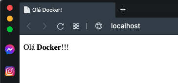
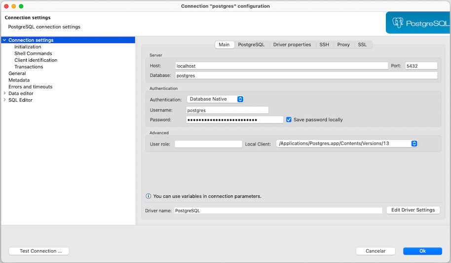
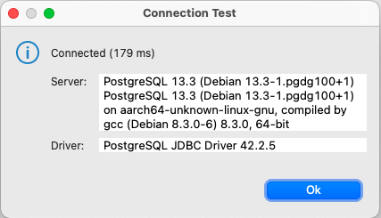

## Exercício 002
Objetivos:
 - Criar um banco de dados com docker 
 - Conhecer os comandos: Select + Where + Group by
 - Conhecer CTEs + Window functions
 - Deduplicar dados
 - Criar, atualizar e deletar tabelas e views 
 - Acessar um banco de dados com Python 
 - Conectar-se a uma ferramenta de BI

### Primeira etapa

Usando Docker vamos montar um HTML-SERVER simples com uma página de "Hello world", para isso vamos usar os arquivos Dockerfile e index.html.

Com nossos arquivos preparados podemos subir nosso servidor, primeiro precisamos montar a imagem dando um "build" e depois iniciar o container com um "run"

`docker build -t httpd .`

Onde:

 - **-t** é para nomear nossa imagem, caso contrário o docker dará um nome qualquer 
 - **web_apache** é o nome que escolhemos
 - **"."** é o local onde esta nosso Dockerfile (nesse caso na mesma pasta)

Agora vamos iniciar nosso containner com

`docker run --name my_apache -d -p 80:80 httpd`

Onde:
 - **--name my_apache** é o nome do nosso containner
 - **-d** é o detach ou seja, executa sem travar o terminal
 - **-p 80:80** é o mapeamento de portas, aqui ele esta encaminhando a porta 80 do container na porta 80 da nossa maquina, não necessáriamente precisa ser o mesmo numero podemos usar um 80:4242
 - **web_apache** é o nome da nossa imagem

Com tudo pronto podemos testar o nosso servidor abrindo o navegador e indo em: <http://localhost:80> onde veremos o seguinte:

  

### Segunda etapa

Agora vamos montar um servidor postgress simples para um banco de dados, para saber qual imagem usar podemos consultar o [DockerHub](https://hub.docker.com)

Para subir uma imagem postgress precisamos de um pouco mais que um Dockerfile, sendo assim vamos usar um arquivo .yml e montar um aquivos para o docker-compose

A diferença entre o Dockerfile e Docker compose é que no Dockerfile você cria uma imagem que os containers irão usar como base para serem iniciados. No Docker compose você poderá criar uma stack de containers a partir de uma imagem base.

Para o nosso exercício criamos um arquivo [docker-compose.yml](https://github.com/agails/How-Bootcamp-Engenharia-de-Dados/blob/master/Module%202/docker-compose.yml)

Com o docker-compose.yml criado iniciamos o stack de containers com o comando:
`docker-compose up db`

Agora utilizando uma IDE como por exemplo o [DBeaver](https://dbeaver.io/download/) vamos configurar a conexão conforme o print abaixo:

  

E clicando no botão **Test Connection...** testar a conexão

  

### Terceira etapa

Agora vamos criar uma tabela e popular com os dados obtidos no kaggle em [Billboard "The Hot 100" Songs](https://www.kaggle.com/dhruvildave/billboard-the-hot-100-songs)

Primeiro criamos uma tabela com os campos necessários usando o scritp [CREATE TABLE Billboard1.sql](https://github.com/agails/How-Bootcamp-Engenharia-de-Dados/blob/master/Module%202/sql/CREATE%20TABLE%20Billboard1.sql)

Então carregamos o CSV baixado do kaggle pelo Dbeaver, para saber como realizar a importação de um **.CSV** pelo DBeaver indico a [Documentação Oficial](https://dbeaver.com/docs/wiki/Data-transfer/)

Agora podemos consultar nossos dados usando alguns SELECTs simples como os encontrados em [SELECT INTO.sql](https://github.com/agails/How-Bootcamp-Engenharia-de-Dados/blob/master/Module%202/sql/SELECT%20INTO.sql)
