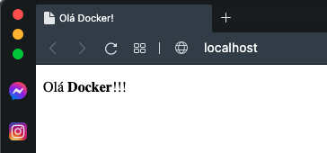

## Primeira etapa Docker

Para utilizar o Dcoker vamos iniciar com um container simples, para isso vamos usar os arquivos [Dockerfile](https://github.com/agails/How-Bootcamp-Engenharia-de-Dados/blob/master/Module%202/docker/Dockerfile) e [index.html](https://github.com/agails/How-Bootcamp-Engenharia-de-Dados/blob/master/Module%202/docker/web/index.html).

Com nossos arquivos preparados podemos subir nosso servidor, primeiro precisamos montar a imagem dando um "build" e depois iniciar o container com um "run"

`docker build -t httpd .`

Onde:

 - **-t** é para nomear nossa imagem, caso contrário o docker dará um nome qualquer 
 - **web_apache** é o nome que escolhemos
 - **"."** é o local onde esta nosso Dockerfile (nesse caso na mesma pasta)

Agora vamos iniciar nosso containner com

`docker run --name my_apache -d -p 80:80 httpd`

Onde:
 - **--name my_apache** é o nome do nosso containner
 - **-d** é o detach ou seja, executa sem travar o terminal
 - **-p 80:80** é o mapeamento de portas, aqui ele esta encaminhando a porta 80 do container na porta 80 da nossa maquina, não necessáriamente precisa ser o mesmo numero podemos usar um 80:4242
 - **web_apache** é o nome da nossa imagem

Com tudo pronto podemos testar o nosso servidor abrindo o navegador e indo em: <http://localhost:80> onde veremos o seguinte:

  

Agora vamos montar um servidor postgress simples para um banco de dados, para saber qual imagem usar podemos consultar o [DockerHub](https://hub.docker.com)

Para subir uma imagem postgress precisamos de um pouco mais que um Dockerfile, sendo assim vamos usar um arquivo .yml e montar um aquivos para o docker-compose

A diferença entre o Dockerfile e Docker compose é que no Dockerfile você cria uma imagem que os containers irão usar como base para serem iniciados. No Docker compose você poderá criar uma stack de containers a partir de uma imagem base.

Para o nosso exercício criamos um arquivo [docker-compose.yml](https://github.com/agails/How-Bootcamp-Engenharia-de-Dados/blob/master/Module%202/docker/docker-compose.yml)

Com o docker-compose.yml criado iniciamos o stack de containers com o comando:
`docker-compose up db`
