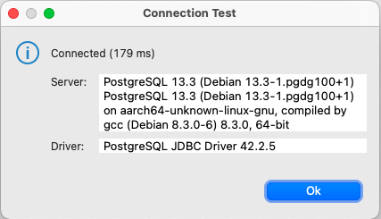

## Segunda etapa SQL

Utilizando uma IDE como por exemplo o [DBeaver](https://dbeaver.io/download/) vamos configurar a conexão conforme o print abaixo:

  

E clicando no botão **Test Connection...** testar a conexão

  

Agora vamos criar uma tabela e popular com os dados obtidos no kaggle em [Billboard "The Hot 100" Songs](https://www.kaggle.com/dhruvildave/billboard-the-hot-100-songs)

Primeiro criamos uma tabela com os campos necessários usando o scritp [CREATE_TABLE.sql](https://github.com/agails/How-Bootcamp-Engenharia-de-Dados/blob/master/Module%202/sql/CREATE_TABLE.sql)

Então carregamos o CSV baixado do kaggle pelo Dbeaver, para saber como realizar a importação de um **.CSV** pelo DBeaver indico a [Documentação Oficial](https://dbeaver.com/docs/wiki/Data-transfer/)

Podemos consultar nossos dados usando alguns SELECTs simples como os encontrados em [Basic_commands.sql](https://github.com/agails/How-Bootcamp-Engenharia-de-Dados/blob/master/Module%202/sql/Basic_commands.sql)

Conhecer CTEs e Window Functions como nos exemplos em [CTEs_Window_Function.sql](https://github.com/agails/How-Bootcamp-Engenharia-de-Dados/blob/master/Module%202/sql/CTEs_Window_Function.sql)

E deduplicar os dados conforme visto em [Deduplication.sql](https://github.com/agails/How-Bootcamp-Engenharia-de-Dados/blob/master/Module%202/sql/Deduplication.sql)