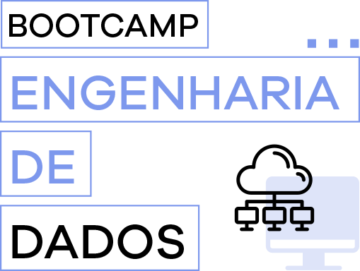

  

## Módulos 1 e 2

### Engenharia de dados

O que é um engenheiro de dados? Como criar uma caixa de ferramentas para ingestão e processamento de dados para nos atender no dia a dia independente da nossa profissão. Overview da profissão de engenharia de dados e diferenças para ciência de dados e business intelligence.

* Módulo 1: **Fundamentos de Engenharia de Dados**
* Módulo 2: **Fundamentos de Ingestão de Dados**

## Módulos 3 a 6

### Fundamentos de ingestão de dados

Os pipelines de engenharia de dados sempre começam com processos de ingestão. Nestes módulos estudaremos os fundamentos começando com processos para ingestão de dados de APIs e também com crawlers. Veremos algumas boas práticas tais como: retentativas, checkpointing e logs. Neste módulo faremos também uma revisão de conceitos python e de SQL.

* Módulo 3: **SQL**
* Módulo 4: **Capturando dados de uma API**
* Módulo 5: **Capturando dados com crawlers**
* Módulo 6: **Testes e Jenkins**

## Módulos 7 a 9

### Testes e Ambientes de Trabalho

Aqui vamos construir alguns ambientes de trabalho, seja localmente ou em uma pequena estrutura com ferramentas como Jenkins e Docker para que possamos entender e aplicar os conceitos que vimos até aqui. Além disso, iniciamos nossa abordagem em um ambiente AWS com a criação de conta na Amazon e o deploy de uma função lambda.

* Módulo 7: **Introdução à AWS**
* Módulo 8: **AWS Lambda**
* Módulo 9: **Git/Github**

## Módulos 10 e 11

### CI/CD Developer tools

Nestes módulos vamos estudar ferramentas para desenvolvimento de software que nos ajudam a gerenciar versões de código e a automatizar testes e deploys. Vamos entender o git flow e aprender boas práticas para desenvolvimento de código em equipes. Também estudaremos integração contínua com o GitHub Actions, executaremos nossos testes de forma automatizada e também faremos o deploy de recursos automaticamente.

* Módulo 10: **CI / CD**
* Módulo 11: **Ingestão de Dados**

 
## Módulos 12 a 20

### Data Lake na AWS

Veremos conceitos e boas práticas de data lakes e então criaremos o nosso lake na AWS utilizando ferramentas como S3, Glue, Athena e Redshift Spectrum. Vamos também estudar processamento de dados utilizando Spark e aprenderemos a orquestrar nossas pipelines de dados utilizando Apache Airflow.
Os módulos que fazem parte desse bloco:

* Módulo 12: **Data Lakes**
* Módulo 13: **AWS Glue + AWS Athena**
* Módulo 14: **Mensageria**
* Módulo 15: **Redshift e Spectrum**
* Módulo 16: **Spark no Databricks**
* Módulo 17: **Spark Streaming no Databricks**
* Módulo 18: **Airflow**
* Módulo 19: **Terraform e Cloudformation**
* Módulo 20: **Data Engineering Portfolio**

## Módulo 21

### Cloudformation e Terraform

Finalmente aprenderemos duas ferramentas para gerenciamento de Infraestrutura como Código que são essenciais para a criação de projetos de engenharia de dados escaláveis e fáceis de manter. Veremos como criar recursos na AWS através de código utilizando Cloudformation e Terraform

## Módulo 22

### Live sobre carreira

Fechando esse curso com chave de ouro, uma live com convidados especiais contando sobre sua carreira e dando dicas de desenvolvimento de portfólio, como se candidatar e atuar em entrevistas, projetos e oportunidades no dia a dia.
